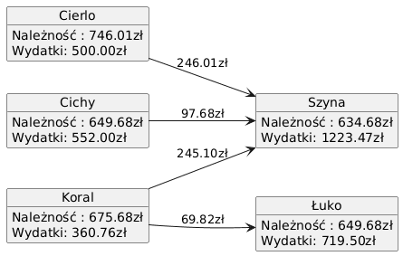

# Raport rozliczeniowy wydatków grupowych

### Uczestnicy rozliczenia
- Szyna
- Łuko
- Cierlo
- Cichy
- Koral

---
### Wydatki
#### Parking
**Płacący:** Łuko  
**Kwota:** 172.60 zł  
**Beneficjenci wydatku:** Szyna, Łuko, Cierlo, Cichy, Koral  
**Należność na głowę:** 34.52 zł

#### Obiad
**Płacący:** Łuko  
**Kwota:** 273.90 zł  
**Beneficjenci wydatku:** Szyna, Łuko, Cierlo, Cichy, Koral  
**Należność na głowę:** 54.78 zł

#### Paliwo Skoda
**Płacący:** Łuko  
**Kwota:** 273.00 zł  
**Beneficjenci wydatku:** Szyna, Łuko, Cierlo, Cichy, Koral  
**Należność na głowę:** 54.60 zł

#### Paliwo Rumunia
**Płacący:** Szyna  
**Kwota:** 239.26 zł  
**Beneficjenci wydatku:** Szyna, Łuko, Cierlo, Cichy, Koral  
**Należność na głowę:** 47.85 zł

#### Hokej Mustata
**Płacący:** Szyna  
**Kwota:** 166.00 zł  
**Beneficjenci wydatku:** Szyna, Cierlo, Koral  
**Należność na głowę:** 55.33 zł

#### Zakupy spożywcze na niedzielę
**Płacący:** Szyna  
**Kwota:** 182.43 zł  
**Beneficjenci wydatku:** Szyna, Łuko, Cierlo, Cichy, Koral  
**Należność na głowę:** 36.49 zł

#### Hantaverna
**Płacący:** Szyna  
**Kwota:** 545.31 zł  
**Beneficjenci wydatku:** Szyna, Łuko, Cierlo, Cichy, Koral  
**Należność na głowę:** 109.06 zł

#### Cierlo - wszelkie wydatki
**Płacący:** Cierlo  
**Kwota:** 500.00 zł  
**Beneficjenci wydatku:** Szyna, Łuko, Cierlo, Cichy, Koral  
**Należność na głowę:** 100.00 zł

#### Zakupy spożywcze na sobotę
**Płacący:** Koral  
**Kwota:** 128.99 zł  
**Beneficjenci wydatku:** Szyna, Łuko, Cierlo, Cichy, Koral  
**Należność na głowę:** 25.80 zł

#### Opłata klimatyczna
**Płacący:** Koral  
**Kwota:** 99.77 zł  
**Beneficjenci wydatku:** Szyna, Łuko, Cierlo, Cichy, Koral  
**Należność na głowę:** 19.95 zł

#### Małpki
**Płacący:** Koral  
**Kwota:** 82.00 zł  
**Beneficjenci wydatku:** Koral, Cierlo  
**Należność na głowę:** 41.00 zł

#### Bryka
**Płacący:** Cichy  
**Kwota:** 211.00 zł  
**Beneficjenci wydatku:** Szyna, Łuko, Cierlo, Cichy, Koral  
**Należność na głowę:** 42.20 zł

#### Kluby
**Płacący:** Cichy  
**Kwota:** 211.00 zł  
**Beneficjenci wydatku:** Łuko, Cierlo, Cichy  
**Należność na głowę:** 70.33 zł

#### Taxi
**Płacący:** Cichy  
**Kwota:** 130.00 zł  
**Beneficjenci wydatku:** Szyna, Łuko, Cierlo, Cichy, Koral  
**Należność na głowę:** 26.00 zł

#### Bolt
**Płacący:** Koral  
**Kwota:** 50.00 zł  
**Beneficjenci wydatku:** Szyna, Łuko, Cierlo, Cichy, Koral  
**Należność na głowę:** 10.00 zł

---
### Indywidualny koszt
|Osoba|Należność|
|---|---|
|Szyna|616.58 zł|
|Łuko|631.58 zł|
|Cierlo|727.92 zł|
|Cichy|631.58 zł|
|Koral|657.58 zł|
---
### Rozliczenie

Cierlo --- 227.92 zł ---> Szyna

Cichy --- 79.58 zł ---> Szyna

Koral --- 208.91 zł ---> Szyna

Koral --- 87.91 zł ---> Łuko

---
### Diagram rozliczenia

*Raport wygenerowano: 25-02-2026 09-12-04*
